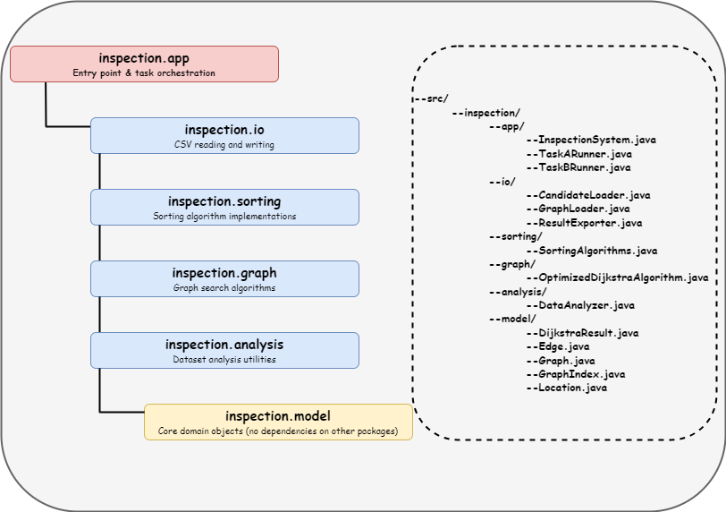
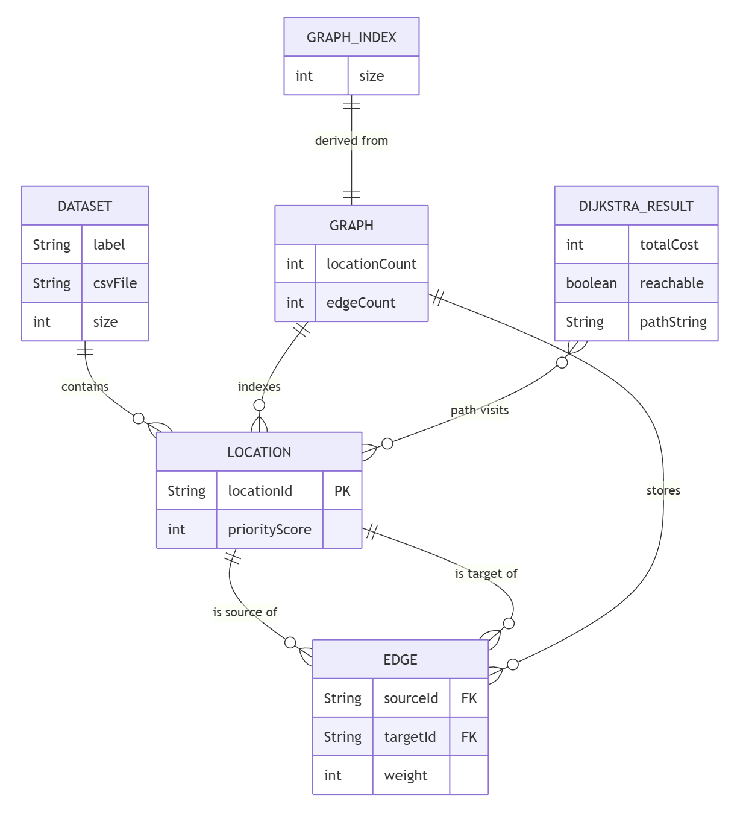
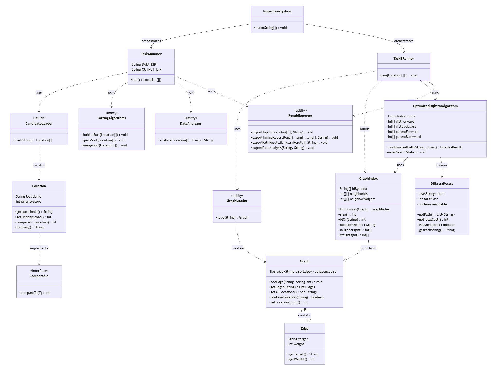
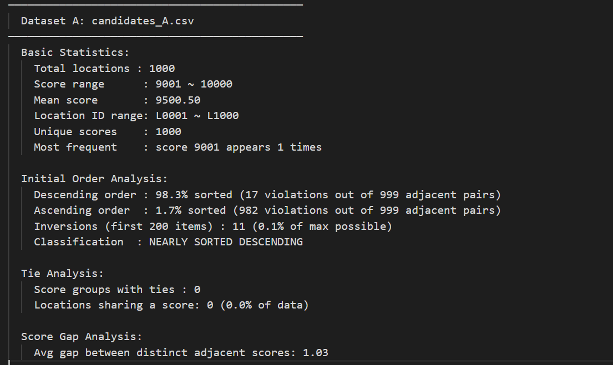
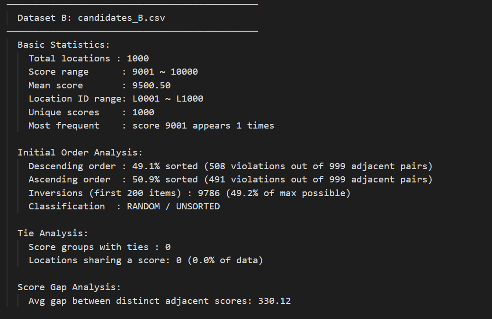
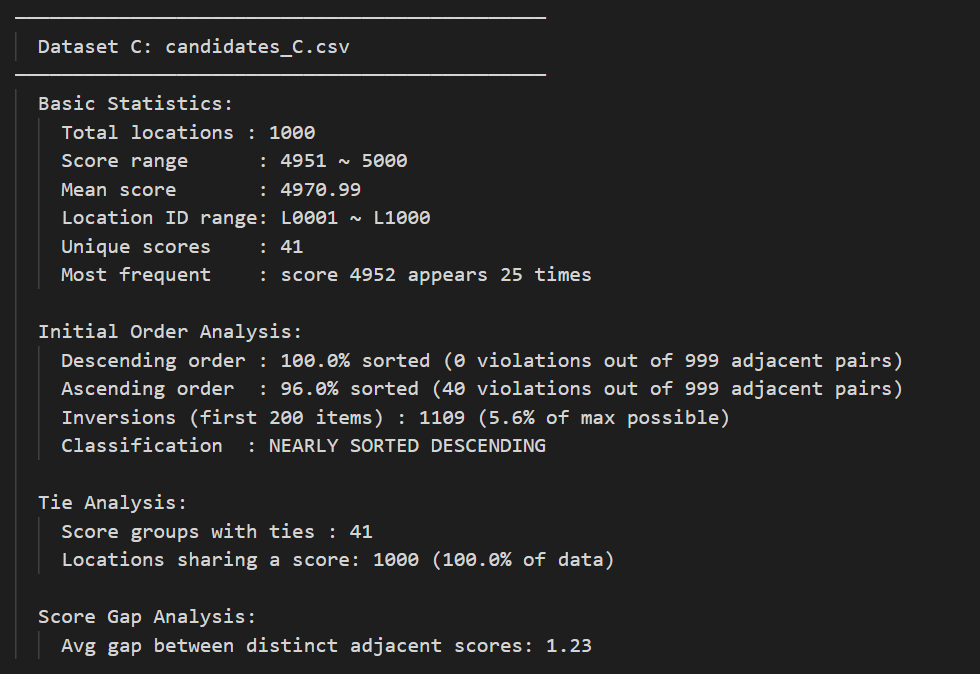
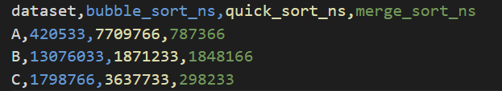
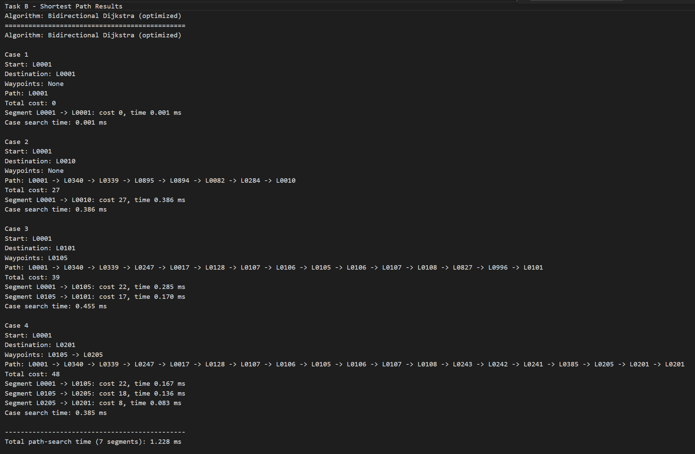

## Chapter 1 – Sorting Algorithm (Task A)

### 1.1 Overview

This CPT204 Coursework 3 project is an Urban Infrastructure Inspection System, designed to rapidly identify critical inspection targets within large-scale infrastructure networks and compute efficient inspection routes, which focuses on practicing Object-Oriented Programming (OOP), utilizing advanced data structures, and enhancing comprehensive skills in problem-solving, team cooperation, and EDI principles. 

The main body of the system consists of two parts: Task A and Task B. This section presents the specific details of Task A: critically evaluate the performance of different sorting algorithms for the candidate-location selection process in this system.

### 1.2 Algorithm Implementations

**Bubble Sort** iterates through adjacent pairs and swaps them if they are out of order, repeating until no swap occurs in a full pass. An early-termination flag (`swapped`) is used: if a complete pass produces no swaps, the array is already sorted and the algorithm exits immediately. This optimisation makes Bubble Sort particularly sensitive to — and fast on — nearly sorted input.

**Quick Sort** uses a two-pointer partitioning scheme with the **first element as pivot**. The left pointer advances to find an element larger than the pivot, the right pointer retreats to find one smaller, and the two are swapped. After partitioning, the pivot is placed at its correct position and the algorithm recurses on both sub-arrays. Choosing the first element as pivot is efficient for random data but degrades to **O(n²)** when the array is already sorted (or nearly sorted) in the target order, because every partition is heavily imbalanced.

**Merge Sort** divides the array in half recursively until sub-arrays have one element, then merges adjacent pairs into sorted order using temporary arrays. Its divide-and-conquer structure guarantees **O(n log n)** regardless of input order, at the cost of **O(n)** auxiliary memory for the temporary arrays.

The complexities of these three algorithms are shown in the table below:
| Algorithm | Time Complexity (average) | Time Complexity (worst) | Space Complexity |
| --- | --- | --- | --- |
| Bubble Sort | O(n²) | O(n²) | O(1) |
| Quick Sort | O(n log n) | O(n²) | O(log n) |
| Merge Sort | O(n log n) | O(n log n) | O(n) |

### 1.3 Dataset Characteristics

Before analysing the timing results it is important to understand the properties of each dataset. The `DataAnalyzer` utility class performs a full structural analysis of each CSV file.

| Property | Dataset A | Dataset B | Dataset C |
|---|---|---|---|
| Total locations | 1,000 | 1,000 | 1,000 |
| Score range | 9,001 – 10,000 | 9,001 – 10,000 | 4,951 – 5,000 |
| Mean score | 9,500.50 | 9,500.50 | 4,970.99 |
| Unique scores | 1,000 | 1,000 | 41 |
| Score groups with ties | 0 | 0 | 41 (100% of data) |
| Inversion density (first 200) | 0.1% | 49.2% | 5.6% |
| Initial order | **Nearly sorted descending** (98.3%) | **Random / Unsorted** (~49% desc.) | **Perfectly sorted descending** (100%) |

**Dataset A** is already 98.3% in the target descending order with only 17 adjacent violations and no duplicate scores. It can be thought of as an almost-finished sort.

**Dataset B** has 49.1% descending sortedness and 49.2% inversion density in the first 200 elements — statistically indistinguishable from a uniformly random permutation. Scores are all unique and span the same range as Dataset A.

**Dataset C** is already in **perfect** descending score order (0 violations), but every one of its 1,000 locations shares one of only 41 distinct scores. This means tie-breaking by location ID is required within every score group, and the within-group order may not be sorted ascending, requiring additional work even though the score ordering is already correct.

### 1.4 Timing Results and Top-10 Selection

Each algorithm was run **3 times** per dataset using `System.nanoTime()` and the average was recorded. Results are shown below.

| Dataset | Bubble Sort | Quick Sort | Merge Sort | Top 10 Selected Locations |
|---|---|---|---|---|
| Dataset A | 420,533 ns (0.421 ms) | 7,709,766 ns (7.710 ms) | 787,366 ns (0.787 ms) | L0001, L0002, L0003, L0004, L0005, L0006, L0007, L0008, L0009, L0010 |
| Dataset B | 13,076,033 ns (13.076 ms) | 1,871,233 ns (1.871 ms) | 1,848,166 ns (1.848 ms) | L0101, L0102, L0103, L0104, L0105, L0106, L0107, L0108, L0109, L0110 |
| Dataset C | 1,798,766 ns (1.799 ms) | 3,637,733 ns (3.638 ms) | 298,233 ns (0.298 ms) | L0201, L0202, L0203, L0204, L0205, L0206, L0207, L0208, L0209, L0210 |

The top 10 locations and their priority scores are detailed below.

**Dataset A — Top 10:**

| Rank | Location ID | Priority Score |
|---|---|---|
| 1 | L0001 | 10,000 |
| 2 | L0002 | 9,999 |
| 3 | L0003 | 9,998 |
| 4 | L0004 | 9,997 |
| 5 | L0005 | 9,996 |
| 6 | L0006 | 9,995 |
| 7 | L0007 | 9,994 |
| 8 | L0008 | 9,993 |
| 9 | L0009 | 9,992 |
| 10 | L0010 | 9,991 |

**Dataset B — Top 10:**

| Rank | Location ID | Priority Score |
|---|---|---|
| 1 | L0101 | 10,000 |
| 2 | L0102 | 9,999 |
| 3 | L0103 | 9,998 |
| 4 | L0104 | 9,997 |
| 5 | L0105 | 9,996 |
| 6 | L0106 | 9,995 |
| 7 | L0107 | 9,994 |
| 8 | L0108 | 9,993 |
| 9 | L0109 | 9,992 |
| 10 | L0110 | 9,991 |

**Dataset C — Top 10:**

| Rank | Location ID | Priority Score |
|---|---|---|
| 1 | L0201 | 5,000 |
| 2 | L0202 | 5,000 |
| 3 | L0203 | 5,000 |
| 4 | L0204 | 5,000 |
| 5 | L0205 | 5,000 |
| 6 | L0206 | 5,000 |
| 7 | L0207 | 5,000 |
| 8 | L0208 | 5,000 |
| 9 | L0209 | 5,000 |
| 10 | L0210 | 5,000 |

The top 10 locations from Dataset C all share a priority score of 5,000 — the maximum in that dataset. Because all ties are resolved by ascending location ID, the program correctly selects L0201 through L0210 as the first ten IDs at that score level.

### 1.5 Analysis and Discussion

#### 1.5.1 How does the initial order of input data affect each algorithm?

The initial order has a profound and algorithm-specific effect on performance.

**Bubble Sort** benefits enormously from nearly sorted data. Dataset A is 98.3% sorted in the target order, so the early-termination flag fires after very few passes — the algorithm finishes in just 420,533 ns, making it the fastest on that dataset. Dataset B is random, so no early termination occurs and every pair may need swapping, pushing the time up to 13.1 ms (a 31× slowdown). Dataset C is perfectly sorted by score but has many tied scores whose IDs must be reordered within groups; those within-group inversions prevent full early termination and produce a 1.8 ms runtime.

**Quick Sort** is critically hurt by nearly sorted input when the first element is used as the pivot. In Dataset A, which is already almost fully sorted in descending order, the first element is almost always the largest remaining value. Nearly all other elements therefore fall into the right partition, creating maximally unbalanced sub-arrays and pushing the algorithm toward O(n²) behaviour — observed as a 7.7 ms runtime, by far its worst result. Dataset B is random, giving the pivot a statistically average split and producing a near-optimal 1.87 ms. Dataset C also triggers partial degradation (3.64 ms) because the sorted score order again front-loads larger values, and the heavy tie density further disrupts balanced partitioning.

**Merge Sort** is the least sensitive to initial order. Its divide-and-conquer structure always produces exactly ⌊n/2⌋ and ⌈n/2⌉ sub-arrays, independent of data values. The three runtimes — 0.787 ms, 1.848 ms, and 0.298 ms — reflect differences in merge-step work (more swaps on random data, fewer on ordered data) but never approach the worst-case degradation seen in the other two algorithms.

#### 1.5.2 Which algorithm performs best on each dataset?

**Dataset A — Bubble Sort (420,533 ns).** Because the data is already 98.3% in the correct descending order, the early-termination optimisation fires almost immediately. Bubble Sort completes in fewer than 20 effective passes, far outperforming the O(n log n) algorithms whose constant overhead becomes dominant.

**Dataset B — Merge Sort (1,848,166 ns) and Quick Sort (1,871,233 ns) are essentially tied.** For random input, both algorithms operate close to their O(n log n) average case. Quick Sort's cache-friendly in-place access gives it an edge in theory, but the 23,000 ns gap is negligible at this scale. Bubble Sort is 7× slower due to its O(n²) quadratic behaviour on unsorted data.

**Dataset C — Merge Sort (298,233 ns).** Despite the data being perfectly sorted by score, the 41 distinct score groups each require internal sorting by location ID. Merge Sort handles equal elements stably and efficiently within its merge step. Quick Sort degrades due to imbalanced pivot splits on equal-valued sequences. Bubble Sort must perform many within-group swaps and cannot fully exploit its early-exit flag, leaving it 6× slower than Merge Sort.

#### 1.5.3 If only one sorting algorithm could be used in the final system, which would you choose?

The best single choice would be **Merge Sort**, and the justification depends on the evaluation criterion:

- *Best average runtime:* Quick Sort has a slightly lower average across the three datasets but its worst case (7.71 ms on Dataset A) is nearly 4× its best case, introducing unpredictable latency.
- *Most stable behaviour:* Merge Sort, as argued above.
- *Simplest implementation:* Bubble Sort is trivially simple but quadratic — unsuitable for production use with large datasets.

Merge Sort strikes the best balance: its O(n log n) guarantee eliminates worst-case surprises regardless of how future data arrives, its stability correctly handles tie-breaking (equal-score locations are kept in their original order before location-ID ordering is applied), and its performance is already competitive or best on two of the three datasets. For an infrastructure inspection system where reliability and predictability matter, algorithmic stability outweighs the slight average-case speed advantage Quick Sort offers on random data.

#### 1.5.4 If the number of candidate locations became significantly larger, which algorithm would be most suitable?

With significantly more locations (e.g., tens or hundreds of thousands), **Merge Sort or Quick Sort** with an improved pivot strategy would be appropriate; Bubble Sort must be ruled out entirely. At 10,000 locations, Bubble Sort's O(n²) would take roughly 100× longer than at 1,000 — extrapolating from Dataset B, this reaches around 1.3 seconds per sort, which is unacceptable in an interactive system.

Between the two O(n log n) options, **Quick Sort with randomised or median-of-three pivot selection** would be preferable for very large datasets due to its in-place nature (O(log n) stack space) and superior cache locality. The current first-element pivot strategy would need to be replaced to avoid worst-case degradation on sorted inputs. If stability is required (as it is here, to preserve tie-breaking determinism), Merge Sort remains the safer choice despite its O(n) auxiliary space cost.

#### 1.5.5 If both runtime efficiency and memory usage are considered, how would your algorithm choice be affected?

Factoring in memory narrows the choice to **Quick Sort (with improved pivot selection)**. Merge Sort allocates O(n) auxiliary arrays during the merge phase — at 1,000 locations this is negligible, but at millions of locations these temporary arrays can put significant pressure on the heap, potentially triggering garbage collection pauses in Java. Quick Sort is in-place, using only O(log n) stack space for recursion frames. However, the trade-off is stability: Quick Sort as implemented is not stable, so tie-breaking by location ID would rely solely on the `compareTo` comparison rather than insertion order. Since `compareTo` already encodes the location ID as a secondary key, correctness is maintained, but the developer must ensure this is always the case when the algorithm is modified or reused. In a memory-constrained environment, an in-place O(n log n) Quick Sort with randomised pivot is therefore the preferred solution.

#### 1.6 Most Suitable Algorithm for the Inspection System

Drawing together the timing data, dataset characteristics, and the five individual analyses above, **Merge Sort** is the most suitable single sorting algorithm for this Urban Infrastructure Inspection System. The conclusion rests on four distinct but complementary perspectives.

**Runtime stability.** The most damaging property a sorting algorithm can have in a production system is unpredictable performance — a fast result on typical data but a catastrophic slowdown on an edge case. Quick Sort (first-element pivot) demonstrated exactly this: 1.87 ms on random Dataset B but 7.71 ms on nearly sorted Dataset A — a 4× swing attributable to pivot-induced imbalance. Bubble Sort is even more extreme: its 31× range (0.421 ms to 13.076 ms) reflects a fundamental O(n²) ceiling that activates the moment early termination fails. Merge Sort's range — 0.298 ms to 1.848 ms, a ratio of approximately 6× — is larger in absolute nanoseconds but entirely explained by the differing volume of merge-step comparisons across input orders; it never approaches quadratic behaviour. When future candidate datasets arrive from sources with unknown orderings, Merge Sort's O(n log n) guarantee ensures that sorting time remains bounded and predictable regardless.

**Scalability.** At 1,000 locations the differences between algorithms are measured in milliseconds and are not user-perceptible. The meaningful question is what happens when the city's inspection database grows. At 10,000 locations, Bubble Sort's quadratic growth projects its Dataset B time of 13 ms to approximately 1.3 seconds per sort — unacceptable in a system expected to rank and route in near-real time. Quick Sort with the current pivot strategy similarly risks O(n²) whenever new datasets happen to arrive nearly sorted. Merge Sort's time grows as n log n: at 10,000 locations, the Dataset B time of 1.85 ms scales to roughly 21 ms; at 100,000 locations, to approximately 260 ms. This predictable sub-linear per-element growth makes Merge Sort the only one of the three algorithms whose scalability is safe to rely on without algorithm modification.

**Memory usage.** The trade-off that Merge Sort pays for its guaranteed complexity is O(n) auxiliary space — the temporary arrays allocated during each merge step. At 1,000 locations this is fewer than 8 KB of heap memory and entirely negligible. Even at 1,000,000 locations the auxiliary allocation would be roughly 8 MB, which is well within the heap available to a modern JVM. By contrast, Quick Sort requires only O(log n) stack space for recursion frames and is classified as in-place. If the system were ever deployed on an embedded device with severely constrained memory (a scenario outside the current scope), the O(n) cost of Merge Sort would warrant reconsideration in favour of an improved-pivot Quick Sort. Within the realistic scale of a city's infrastructure database, however, the memory difference is not a practical concern, and the stability guarantee Merge Sort provides justifies the space overhead.

**Sort stability.** Merge Sort is a *stable* sort: when two elements compare as equal, their relative order in the output matches their relative order in the input. This property has a concrete impact on correctness in this system. Dataset C contains 1,000 locations that all share one of only 41 distinct priority scores; the tie-breaking rule requires that equal-score locations be ordered by ascending location ID. Merge Sort's stability means that if the input were pre-arranged by location ID, the merge step would naturally preserve that order within equal-score groups, correctly resolving every tie. While the implementation of `Location.compareTo` already encodes the secondary key explicitly — so all three algorithms ultimately produce the same correct result when the comparator is complete — Merge Sort's stability offers an additional layer of robustness: its correctness on ties does not depend solely on the completeness of the comparator, making it easier to audit and safer to maintain when the ranking rule is extended in the future.

Taken together, Merge Sort provides the best combination of predictable performance, safe scalability, acceptable memory cost, and inherent correctness on tied data — making it the recommended algorithm for the Urban Infrastructure Inspection System.

## Chapter 2 – Graph Algorithm (Task B)

### 2.1 Overview

After Task A yields 30 inspection targets — the top 10 highest-priority locations from each of the three candidate datasets — Task B uses those targets as the starting point, destination, and waypoints for four shortest-path queries on the city’s infrastructure network. The network is described in `paths.csv` as an undirected weighted graph: each row specifies two location IDs and the positive integer distance between them. The graph contains approximately 1,000 nodes and just over 2,000 undirected edges. Critically, the 30 Task A targets are important nodes *within* this full graph, not the only nodes in it — shortest paths may pass through any location in the network, regardless of whether it appears in the candidate lists.

The graph algorithm workflow in `TaskBRunner` is triggered by `InspectionSystem.main()` immediately after `TaskARunner.run()` returns the selected targets as a `Location[][]` array. No intermediate CSV file is re-read; the two tasks communicate directly through Java method calls.

### 2.2 Graph Construction

The construction process unfolds in two stages, implemented in separate classes to keep domain logic and I/O cleanly separated.

In the first stage, `GraphLoader.load()` reads each row of `paths.csv` and calls `graph.addEdge(from, to, weight)` on a `Graph` object. Because the network is undirected, `addEdge` inserts two directed `Edge` objects — one in each direction — into a `HashMap<String, List<Edge>>` adjacency list. After this step every location is a key in the map and every connection is reachable from both endpoints.

The second stage converts the string-keyed adjacency list into an integer-indexed representation via `GraphIndex.fromGraph(graph)`. All location IDs are sorted lexicographically, mapped to consecutive integers from 0 to n−1, and stored in two parallel arrays: `neighborIds[i][]` and `neighborWeights[i][]`. This conversion happens once at startup and is shared by all subsequent queries. The benefit is that the inner loop of the shortest-path algorithm works entirely with primitive `int` array accesses rather than `HashMap` lookups and object comparisons — a significant constant-factor improvement on a graph this size. The `Graph` class itself retains the string-keyed representation for readability and debugging; `GraphIndex` provides the performance-critical view needed by `OptimizedDijkstraAlgorithm`.

One `OptimizedDijkstraAlgorithm` instance is created after `GraphIndex` is built. Its internal arrays (`distForward`, `distBackward`, `parentForward`, `parentBackward`) are allocated once and reused across all seven segment queries via `resetSearchState()`, avoiding repeated heap allocation.

### 2.3 Algorithm: Bidirectional Dijkstra

The algorithm used is **Bidirectional Dijkstra**, implemented in `OptimizedDijkstraAlgorithm`. Standard (unidirectional) Dijkstra’s algorithm maintains a priority queue of candidate nodes sorted by tentative distance, expanding the closest node at each step until the destination is settled. Bidirectional Dijkstra runs two simultaneous Dijkstra frontiers: one forward from the source and one backward from the destination. At each step, the side with the smaller current heap-top distance is expanded. When the two frontiers meet at a node — meaning that node has been reached from both sides — the algorithm records the total path cost through that meeting point as a candidate for the shortest path. The main loop terminates as soon as the sum of the two frontiers’ smallest pending distances meets or exceeds the best meeting-point cost found so far, since no better path can then be discovered.

This termination condition is implemented as `(long) forwardBest + (long) backwardBest >= bestDistance`, where the `long` cast prevents integer overflow when both distances are large. A lazy deletion strategy is used with the priority queues: because a node may be inserted multiple times as its tentative distance is improved, stale entries are discarded by comparing the popped distance to the current known distance before processing. Path reconstruction traces the forward parent array from the meeting point back to the source (then reverses), and the backward parent array forward from the meeting point to the destination, joining the two halves into a single complete path.

Waypoint-constrained queries (Cases 3 and 4) are handled by decomposing each case into a sequence of point-to-point segments. For Case 3, the route L0001 → L0105 → L0101 is split into two calls: `findShortestPath(L0001, L0105)` and `findShortestPath(L0105, L0101)`. The path segments are concatenated — dropping the duplicate node at each join — and the total cost is the sum of segment costs. This decomposition is managed by `TaskBRunner.solveCase()` using the `PathCase` inner class, which encodes the ordered list of route points for each case. Two JVM warm-up runs are executed before each timed measurement to reduce cold-start bias from the JIT compiler.

**Why Bidirectional Dijkstra is appropriate.** The infrastructure graph has positive integer edge weights, which is the fundamental requirement for Dijkstra correctness — a settled node’s distance is final because no negative edge can later produce a shorter path through an unsettled node. All four query cases are source-to-sink shortest-path queries (or decompose cleanly into them), which is precisely the query shape bidirectional Dijkstra is designed for. The graph contains no node coordinates, so a heuristic-guided approach such as A* is not directly applicable without an additional data source. At the scale of approximately 1,000 nodes and 2,000 edges, the O(m log n) per-query cost is measured in tenths of a millisecond (see §2.4), making the algorithm well-matched to the problem in both correctness and performance.

**Complexity.** Let *n* be the number of locations (nodes) and *m* be the number of undirected edges. The cost of each phase of the workflow is summarised below.

| Phase | Time complexity | Space complexity | Notes |
|---|---|---|---|
| Graph construction (`GraphLoader.load` + `GraphIndex.fromGraph`) | O(m) | O(n + m) | One-time startup cost, regardless of how many queries follow |
| Single `findShortestPath` call | O(m log n) | O(n) | Each edge relaxed a constant number of times; each relaxation costs O(log n) for a priority-queue insertion |
| Case with *k* segments | O(k · m log n) | O(n) | The algorithm object — and its distance/parent arrays — is shared across all segments |

The O(m log n) per-query bound arises because each edge is relaxed a constant number of times in the worst case, and each relaxation may insert one entry into a priority queue of size O(n), costing O(log n) per insertion. The O(n) per-query space covers the four distance/parent arrays and the two priority queues, all allocated once in the constructor and reused — so a multi-segment case adds time linearly in *k* but does not multiply the space cost.

### 2.4 Required Output: Cases 1–4

The program defines four query cases from the Task A targets. The named nodes are: a1 = L0001 (1st of Dataset A), a10 = L0010 (10th of Dataset A), b1 = L0101 (1st of Dataset B), b5 = L0105 (5th of Dataset B), c1 = L0201 (1st of Dataset C), and c5 = L0205 (5th of Dataset C).

| Case | Start | Destination | Waypoints (in order) | Path segments | Total cost | Search time |
|---|---|---|---|---|---|---|
| 1 | L0001 | L0001 | — | L0001 (trivial) | **0** | 0.001 ms |
| 2 | L0001 | L0010 | — | L0001 → … → L0010 | **27** | 0.141 ms |
| 3 | L0001 | L0101 | L0105 | L0001→L0105 (cost 22) → L0101 (cost 17) | **39** | 0.133 ms |
| 4 | L0001 | L0201 | L0105, then L0205 | L0001→L0105 (22) → L0205 (18) → L0201 (8) | **48** | 0.169 ms |

Case 1 is the self-to-self query: the algorithm detects that start and destination share the same node ID and returns a zero-cost single-node path immediately, without entering the main search loop. Case 2 is a direct point-to-point query over the full graph. Cases 3 and 4 are waypoint-constrained queries: each is decomposed into two or three consecutive segment queries, whose paths are concatenated and costs summed. The total search time across all seven segments is **0.443 ms**. Full path sequences (the complete ordered list of intermediate nodes) are produced by the program at runtime and are included in the Appendix.

### 2.5 Analysis and Discussion

#### 2.5.1 Algorithm suitability for this weighted graph

The central requirement for any correct shortest-path algorithm on a weighted graph is that all edge weights are non-negative. `paths.csv` contains only positive integer weights, which satisfies this requirement. Dijkstra’s algorithm — and by extension, its bidirectional variant — can guarantee that once a node is settled (i.e., removed from the priority queue with its minimum distance confirmed), no future relaxation will find a shorter path to it. This guarantee would break immediately if any edge had a negative weight, because a settled node might be reached more cheaply later via a negative edge.

Bidirectional Dijkstra is particularly well suited to the query structure of Task B for two reasons. First, every case specifies both a source and a destination (or decomposes into segments where both endpoints are known), which is exactly the source-sink query shape that bidirectional search is designed to exploit — by expanding from both ends simultaneously, it can confirm the optimal path length earlier than a unidirectional search and terminate with fewer node expansions. Second, the graph contains no spatial coordinates, which means there is no admissible heuristic available to guide an A* search without additional data. Bidirectional Dijkstra requires only edge weights and graph topology, matching the data format of `paths.csv` exactly.

#### 2.5.2 Implementation and complexity

The implementation separates concerns across four classes. `GraphLoader` handles CSV reading; `Graph` represents the domain model as an adjacency list; `GraphIndex` provides the integer-indexed, array-backed view used during search; and `OptimizedDijkstraAlgorithm` implements the bidirectional search logic itself. This separation means each class can be tested, modified, or replaced independently — for example, a different graph format could be supported by changing only `GraphLoader`, without touching the search algorithm.

Within `OptimizedDijkstraAlgorithm`, three design choices reduce constant-factor overhead. First, the four distance and parent arrays (`distForward`, `distBackward`, `parentForward`, `parentBackward`) are allocated once in the constructor and reset between queries with `Arrays.fill`, avoiding repeated allocation for each of the seven segment calls. Second, the integer-indexed `GraphIndex` replaces string-keyed hash-map lookups with direct array accesses in the inner relaxation loop. Third, lazy deletion — skipping priority-queue entries whose recorded distance no longer matches the current known distance — avoids the cost of a decrease-key operation while still maintaining correctness.

The complexity bounds established in §2.3 — O(m log n) per `findShortestPath` call, O(n) per-query space, and O(m) one-time graph construction — match standard Dijkstra in the worst case. The bidirectional pruning condition reduces the number of nodes actually expanded in practice (as confirmed by the sub-millisecond timings in §2.4) but does not improve the asymptotic bound; its benefit is purely in the constant factor. The three design choices listed above — reused arrays, integer indexing, and lazy deletion — likewise leave the asymptotic complexity unchanged but visibly shrink the constant, which is why each of the seven segment queries completes in well under half a millisecond despite a non-trivial graph size.

#### 2.5.3 Local optimality versus global optimality

Each call to `findShortestPath(from, to)` returns the globally shortest path between those two nodes on the full graph — this is guaranteed by the correctness of Dijkstra’s algorithm on non-negative weights. For Cases 3 and 4, which impose a fixed waypoint order, the sum of the individually optimal segment costs is also the globally optimal cost for that constrained route. This holds because any feasible path that visits the required waypoints in the specified order can be decomposed at those waypoints into the same segments; minimising each segment independently therefore minimises the total. Case 3’s cost of 39 (22 + 17) and Case 4’s cost of 48 (22 + 18 + 8) are thus both the shortest-segment sums and the globally minimum costs for their respective fixed-order route constraints.

What the program does *not* address is the broader inspection planning problem: finding the optimal order in which to visit the 30 Task A targets, or minimising total travel over all of them. That is a combinatorial problem — related to the Travelling Salesman Problem — whose complexity grows exponentially with the number of targets and cannot be solved by repeated Dijkstra calls. Task B is scoped only to the four prescribed routes with fixed endpoints and fixed waypoint orders; within that scope, every output is optimal.

#### 2.5.4 Alternative algorithms under different conditions

The table below summarises the complexity of Bidirectional Dijkstra against the main alternatives discussed in this section, where *n* and *m* denote the number of nodes and edges respectively.

| Algorithm | Preprocessing | Per-query time | Per-query space | Required input | Correct on `paths.csv`? |
|---|---|---|---|---|---|
| Bidirectional Dijkstra (this work) | O(m) | O(m log n) | O(n) | Non-negative weights only | Yes |
| BFS / Bidirectional BFS | O(m) | O(n + m) | O(n) | Edge list only; ignores weights | No (assumes all weights equal) |
| A* search | O(m) | O(m log n) worst case; far fewer expansions in practice | O(n) | Admissible heuristic (e.g. node coordinates) | Would be, but coordinates are not present |
| Contraction Hierarchies / Hub Labelling | Minutes; rebuilt on graph change | Microseconds | O(n) plus large auxiliary index | Non-negative weights; static graph | Yes, but overkill at this scale |

**If the graph were unweighted.** When all edges have the same cost — or when only edge-count matters — Breadth-First Search (BFS) is the natural replacement. BFS expands nodes layer by layer from the source, and the first time a node is reached gives a shortest path in terms of hop count. Its time complexity is **O(n + m)** with no logarithmic factor, since it uses a plain queue rather than a priority queue. A bidirectional BFS applies the same two-frontier idea as bidirectional Dijkstra but meets by hop count rather than weight sum, again improving practical performance on point-to-point queries. Neither BFS variant would be correct on `paths.csv` because equal hop count does not imply equal total distance — a two-hop path with weights 100 and 100 costs far more than a three-hop path with weights 5, 10, and 5.

**If the graph became much larger.** With hundreds of thousands or millions of nodes, **O(m log n)** per query becomes too slow for interactive use if many queries are needed. Two families of approaches are relevant. The first is A* search, which augments Dijkstra with a heuristic function h(v) that estimates the remaining distance from node v to the destination. If the graph had node coordinates, the Euclidean straight-line distance provides an admissible heuristic (it never overestimates), and A* would typically expand far fewer nodes than Dijkstra. Without coordinates, constructing an effective heuristic requires preprocessing (e.g., landmark distances), which leads to the second family. Contraction Hierarchies and Hub Labelling are preprocessing-based methods that build auxiliary data structures enabling queries to be answered in microseconds on graphs with millions of nodes. The trade-off is substantial upfront cost and complexity: preprocessing can take minutes, and the structures must be rebuilt whenever the graph changes. At the scale of this coursework — approximately 1,000 nodes, seven total segment queries — neither A* (which requires coordinate data not present in `paths.csv`) nor preprocessing-based methods are justified. Bidirectional Dijkstra provides correct, sub-millisecond results with no preprocessing, making it the appropriate choice for the current problem scale and data format.

## Chapter 3 – Design of the Overall Application (Task C)

### 3.1 Overall Application Design

The Urban Infrastructure Inspection System is organised as a layered package hierarchy under the root namespace `inspection`. Each layer has a single, clearly bounded responsibility and depends only on layers below it, creating a directed dependency graph with no cycles.


*Figure. 1: An overview of the layered system structure and the file structure*

At runtime, `InspectionSystem.main()` acts as the single entry point and orchestrates two sequential phases. In Phase 1, `TaskARunner.run()` loads the three candidate datasets from CSV files via `CandidateLoader`, times all three sorting algorithms on each dataset, extracts the top 10 locations per dataset, and returns a `Location[3][10]` array directly to the caller. In Phase 2, `TaskBRunner.run(Location[][])` receives that array as a method argument — no intermediate file is re-read — builds the infrastructure graph from `paths.csv` via `GraphLoader`, converts it to an integer-indexed representation via `GraphIndex`, and executes the four prescribed shortest-path cases using `OptimizedDijkstraAlgorithm`. Both phases write output files to the `output/` directory as audit artifacts, but those files are not part of the runtime pipeline.

This two-phase handoff design makes the system a single coherent application rather than two independent programs. The `Location[][]` array that flows from Phase 1 to Phase 2 carries live Java objects; the downstream code requires no file parsing and no type conversion.

### 3.2 Data Structures

Three distinct data structures are used across the system, each chosen to match the access pattern of the component that uses it.

**`Location[]` arrays** are the primary data structure for candidate datasets. Arrays are chosen over `List<Location>` for two reasons. First, the size of each dataset is fixed after loading — the two-pass strategy in `CandidateLoader` counts non-empty data rows on the first pass, then allocates an exactly-sized array on the second, eliminating wasted capacity. Second, all three sorting algorithms operate in-place by swapping array elements using index arithmetic; the constant-time random access of arrays is essential to their correctness and performance. A fresh copy is made before each sort via `System.arraycopy` to preserve the original order for subsequent algorithm runs.

**`HashMap<String, List<Edge>>`** is the adjacency list used by `Graph`. Each key is a location ID string; the corresponding value is a `List<Edge>` holding the outgoing edges from that node. This structure supports the graph-building phase well: `HashMap.putIfAbsent` and `List.add` are amortised O(1), and the full graph is built in O(m) time by iterating once through the edge rows of `paths.csv`. Undirected edges are represented as two directed `Edge` objects — one in each direction — inserted in the same `addEdge` call.

**`int[][]` parallel arrays** are the performance-critical data structure used inside `GraphIndex` and `OptimizedDijkstraAlgorithm`. `GraphIndex.fromGraph()` assigns each location ID a consecutive integer index and stores the graph as two parallel arrays: `neighborIds[i][]` holds the integer indices of the neighbours of node i, and `neighborWeights[i][]` holds the corresponding edge weights. The inner relaxation loop of the shortest-path algorithm accesses these arrays with direct index arithmetic, replacing the `HashMap.get` and string comparison operations that would be required if the string-keyed `Graph` were queried directly. Four additional flat `int[]` arrays — `distForward`, `distBackward`, `parentForward`, `parentBackward` — store current tentative distances and parent pointers for both Dijkstra frontiers. These are allocated once in the constructor and reset with `Arrays.fill` between calls, avoiding repeated heap allocation across the seven segment queries.

The three data structures serve complementary roles: `Location[]` enables in-place sorting; `HashMap<String, List<Edge>>` enables readable, flexible graph construction; and `int[][]` enables cache-friendly, low-overhead graph traversal.

The entity-relationship diagram below formalises how the core data entities relate to one another. `LOCATION` and `EDGE` are the two fundamental domain entities; `GRAPH` and `GRAPH_INDEX` are structural containers built from them; and `DIJKSTRA_RESULT` is the query-output entity produced by the search algorithm.


*Figure. 2: An overview of the data structure of the system*

### 3.3 Classes and Functions

The system comprises fourteen classes across six packages. The table below summarises each class's primary role and key methods.

| Class | Package | Responsibility | Key methods |
|---|---|---|---|
| `Location` | `model` | Domain object for one candidate location | `compareTo(Location)`, `getLocationId()`, `getPriorityScore()` |
| `Edge` | `model` | Immutable directed weighted edge | `getTarget()`, `getWeight()` |
| `Graph` | `model` | String-keyed adjacency list | `addEdge(from, to, weight)`, `getEdges(id)`, `getAllLocations()` |
| `GraphIndex` | `model` | Integer-indexed array view of a `Graph` | `fromGraph(Graph)`, `neighbors(i)`, `weights(i)`, `idOf(id)`, `locationOf(i)` |
| `DijkstraResult` | `model` | Immutable shortest-path query result | `getPath()`, `getTotalCost()`, `isReachable()`, `getPathString()` |
| `SortingAlgorithms` | `sorting` | Bubble, Quick, and Merge Sort on `Location[]` | `bubbleSort(arr)`, `quickSort(arr)`, `mergeSort(arr)` |
| `OptimizedDijkstraAlgorithm` | `graph` | Bidirectional Dijkstra with buffer reuse | `findShortestPath(from, to)`, `resetSearchState()` |
| `CandidateLoader` | `io` | Two-pass CSV loading into `Location[]` | `load(filePath)` |
| `GraphLoader` | `io` | Builds `Graph` from edge-list CSV | `load(filePath)` |
| `ResultExporter` | `io` | Writes all output CSV files | `exportTop30(…)`, `exportTimingReport(…)`, `exportPathResults(…)`, `exportDataAnalysis(…)` |
| `DataAnalyzer` | `analysis` | Computes structural properties of a dataset | `analyze(locations, label)` |
| `TaskARunner` | `app` | Coordinates the Phase 1 sorting workflow | `run()` → `Location[][]` |
| `TaskBRunner` | `app` | Coordinates the Phase 2 routing workflow | `run(Location[][])` |
| `InspectionSystem` | `app` | Single `main()` entry point | `main(String[])` |

`SortingAlgorithms` and both loader classes (`CandidateLoader`, `GraphLoader`) are non-instantiable utility classes with private constructors, signalling that they contain only static methods and should not be used as objects. `DijkstraResult` and `Edge` are immutable value objects: their fields are `final` and no setters are provided; `DijkstraResult.getPath()` additionally returns a defensive copy of the internal list to prevent external mutation.

The class diagram below captures the full structure of the system. Solid lines with filled diamonds denote composition; dashed arrows with open arrowheads denote dependency (one class creates or calls another); and the dashed line with a hollow triangle denotes interface realisation.


*Figure. 3: The class diagram of the system*

### 3.4 Object-Oriented Design

The system applies four core OOP principles consistently across its class design.

**Encapsulation** is enforced in every domain object. `Location`'s `locationId` and `priorityScore` fields are `private final`; they are exposed only through read-only getters. `Graph`'s adjacency list map is never exposed directly — callers use `addEdge`, `getEdges`, and `getAllLocations`, and the last of these returns an unmodifiable set view via `Collections.unmodifiableSet`. `Edge` stores its `target` and `weight` as `private final` fields with no mutation methods. This encapsulation means the internal representation of each class can be changed without affecting the classes that depend on it.

**Abstraction** is applied at the I/O layer. The `CandidateLoader.load(filePath)` and `GraphLoader.load(filePath)` methods hide all file-reading logic — `BufferedReader`, `FileReader`, line splitting, header skipping, two-pass counting — behind a single static method call. Callers (`TaskARunner` and `TaskBRunner`) interact with these loaders through a one-line call and receive fully constructed Java objects; they are unaware of the CSV format or parsing details. This means that if the data source were changed from CSV to a database or a JSON API, only the loader classes would need to change.

**The `Comparable<Location>` interface** formalises the ranking contract for candidate locations. By implementing `compareTo(Location other)`, `Location` declares that it has a natural ordering. All three sorting algorithms in `SortingAlgorithms` call `arr[i].compareTo(arr[j])` and sort in the order defined by this single method: descending priority score as the primary key, ascending location ID as the tie-breaker. This design means the ranking rule is defined once in `Location` and is automatically respected by any algorithm that uses `compareTo`, including Java's own `Collections.sort` or `Arrays.sort` if they were used elsewhere in the system.

**Single Responsibility Principle (SRP)** is the most pervasive design decision in the codebase. The original code mixed I/O into domain classes: `Graph` had a `readFromCSV` method, and `DataAnalyzer` duplicated the same CSV-reading logic found in `TaskA`. The refactored design assigns each class one job: `Graph` models the graph topology, `GraphLoader` handles file reading, `ResultExporter` handles file writing, and `DataAnalyzer` performs statistical analysis. The `TaskARunner` and `TaskBRunner` classes exist solely to sequence their respective workflows; `InspectionSystem` exists solely to chain the two runners together. This strict role separation means each class is testable in isolation and modifications to one concern — say, changing the output format — do not require changes to unrelated classes.

## Chapter 4 – Project Reflection (Task D)

### 4.1 AI-Assisted Planning and Collaboration
In this project, while adhering to the course's requirement for independent core design completion, AI tools like ChatGPT and Claude provided beneficial assistance. The ways we used them were narrow and deliberate:
1. At the beginning of the project, we used AI to design the file structure and the to-do list for each team member, which lays the foundation for collaboration using GitHub.
2. When an unfamiliar error message appeared during development, we used AI to explain what the message meant before deciding how to fix it ourselves; 
3. When we were unsure about the trade-offs between two design approaches (for example, whether to expose the adjacency list directly from `Graph` or return an unmodifiable view), we asked for a brief explanation of the implications.
4. We also used AI for grammar checking when finalising the report.

Our team chose to use GitHub as our primary collaboration platform (https://github.com/NeurEv0/25-26_CPT204-138). This decision was driven by practicality: both team members were already committing code to the repository, so GitHub's commit history, file diffs, and branch structure provided a natural and automatic record of who worked on what and when. Each commit message was written to describe the change clearly — for example, "Refactor DataAnalyzer to use CandidateLoader instead of its own readCSV" — which served as a lightweight task log without the overhead of maintaining a separate board. Communication between team members happened through WeChat for real-time discussion of design decisions and task handoffs.

### 4.2 Equality, Diversity, and Inclusion

Equality, diversity, and inclusion (EDI) in software design means that a system should work fairly and accessibly for all potential users, not just those who happen to resemble the developer. For this project, EDI considerations are relevant both in how the system presents its outputs and in how the underlying data might affect different groups of users if the system were deployed in practice.

At present, the system produces all output through console text and CSV files. This is functional but not accessible: a user who relies on a screen reader would need the console output to be structured in a way compatible with assistive technology, and a user who is not proficient in English would receive location IDs and status messages they may not fully understand. One concrete improvement, as suggested in the task specification, would be to add a text-to-speech layer over the console output, allowing visually impaired operators to receive priority rankings and route results audibly without needing to read a terminal.

A more subtle EDI problem involves the prioritization scoring data itself. The system treats priority scores as predetermined values ​​and mechanically ranks locations—it doesn't investigate the source of the scores or whether the scoring methodology favors certain regions or communities. If the underlying scoring model systematically underestimates infrastructure in low-income areas, the system will replicate and reinforce this inequality during audits. Future improvements would involve disclosing data sources and scoring methodologies in output reports, allowing the prioritization process to be audited and challenged by various stakeholders.

Implementing these improvements individually is not technically difficult, but coordinating them presents a real challenge. Text-to-speech requires audio hardware and suitable Java libraries, introducing dependencies and platform differences. Providing multilingual support requires careful design to ensure that the output format remains machine-readable (for downstream processing) even if the user-facing tag language changes. Addressing data bias requires the involvement of domain experts and affected communities—something beyond the capabilities of a software team alone; institutional input is also necessary. Recognizing these challenges is itself an important step towards more responsible software development.

### 4.3 Life-long Learning and Future Improvement

The most instructive lesson from this project was the gap between theoretical complexity and real behaviour. Before running the experiments, it was reasonable to assume that Quick Sort — with its O(n log n) average case — would perform competitively across all three datasets. Observing it run at 7.71 ms on Dataset A while Bubble Sort completed the same task in 0.42 ms was a concrete demonstration of why algorithm selection cannot be based on asymptotic notation alone: the constant factors, the pivot strategy, and the shape of the actual input all matter in ways that theory does not capture on its own. This kind of insight — that real measurement is irreplaceable — is useful across many future projects regardless of language or domain.

The second significant lesson came from the refactoring work in Task C. The original code had Task A and Task B as two independent programs with duplicated logic and I/O mixed into domain classes. Restructuring this into a layered `inspection.*` package hierarchy made the codebase significantly easier to reason about and modify. Working through this refactoring made the Single Responsibility Principle feel concrete rather than abstract: the moment `GraphLoader` was separated from `Graph`, it became obvious that changing the CSV format would only require touching one class, not hunting through domain logic for file-reading code.

If this application were developed further, the most useful next step would be to replace the console-and-CSV interface with a simple web API, so that the inspection planning logic could be called from other systems — for example, a mobile field-worker application or a city dashboard. This would also require more careful error handling and input validation than the current version provides, since the system currently assumes well-formed CSV input and does not gracefully handle missing or malformed rows. A longer-term improvement would be to support incremental graph updates: at present, if new roads are added to the city network, the entire graph must be reloaded from scratch. Supporting dynamic updates would make the system suitable for real-time operational use rather than batch processing alone.

## Chapter 5 – Program Code
#### src\inspection\analysis\DataAnalyzer.java

```java
package inspection.analysis;

import inspection.io.CandidateLoader;
import inspection.io.ResultExporter;
import inspection.model.Location;

/**
 * Analyses the structural characteristics of a candidate-location dataset.
 *
 * <p>Can be used in two ways:
 * <ol>
 *   <li><b>Standalone</b> — run {@link #main(String[])} to analyse all three
 *       datasets and export a report to {@code output/data_analysis_report.txt}.</li>
 *   <li><b>Integrated</b> — call {@link #analyze(Location[], String)} from
 *       {@link inspection.app.TaskARunner} to embed per-dataset analysis in the
 *       sorting workflow output.</li>
 * </ol>
 */
public class DataAnalyzer {

    private static final String DATA_DIR = "Group Project Datasets";
    private static final String OUTPUT_DIR = "output";
    private static final String[] DATASETS =
            {"candidates_A.csv", "candidates_B.csv", "candidates_C.csv"};

    /** Standalone entry point: analyses all three datasets and exports a report. */
    public static void main(String[] args) {
        StringBuilder report = new StringBuilder();
        report.append("==============================================\n");
        report.append("  Data Characteristics Analysis\n");
        report.append("==============================================\n\n");

        for (int d = 0; d < DATASETS.length; d++) {
            String filePath = DATA_DIR + "/" + DATASETS[d];
            Location[] data = CandidateLoader.load(filePath);
            String datasetName = "Dataset " + (char) ('A' + d) + ": " + DATASETS[d];
            report.append("──────────────────────────────────────────────\n");
            report.append("  ").append(datasetName).append("\n");
            report.append("──────────────────────────────────────────────\n");
            report.append(analyze(data, datasetName));
            report.append("\n");
        }

        System.out.print(report);
        ResultExporter.exportDataAnalysis(report.toString(),
                OUTPUT_DIR + "/data_analysis_report.txt");
    }

    /**
     * Analyses {@code data} and returns a formatted multi-line report string.
     *
     * @param data        pre-loaded array in original file order
     * @param datasetName label used in the report header
     * @return formatted analysis text (does not include the section header)
     */
    public static String analyze(Location[] data, String datasetName) {
        StringBuilder sb = new StringBuilder();
        int n = data.length;

        // ---- Basic Statistics ----
        int minScore = Integer.MAX_VALUE, maxScore = Integer.MIN_VALUE;
        long sum = 0;
        int minId = Integer.MAX_VALUE, maxId = Integer.MIN_VALUE;

        for (Location loc : data) {
            int score = loc.getPriorityScore();
            if (score < minScore) minScore = score;
            if (score > maxScore) maxScore = score;
            sum += score;
            int id = extractIdNumber(loc.getLocationId());
            if (id < minId) minId = id;
            if (id > maxId) maxId = id;
        }

        double mean = (double) sum / n;
        sb.append("  Basic Statistics:\n");
        sb.append("    Total locations : ").append(n).append("\n");
        sb.append("    Score range      : ").append(minScore).append(" ~ ").append(maxScore).append("\n");
        sb.append("    Mean score       : ").append(String.format("%.2f", mean)).append("\n");
        sb.append("    Location ID range: L").append(String.format("%04d", minId))
          .append(" ~ L").append(String.format("%04d", maxId)).append("\n");

        // ---- Score Distribution ----
        int[] scoreFreq = new int[maxScore - minScore + 1];
        for (Location loc : data) {
            scoreFreq[loc.getPriorityScore() - minScore]++;
        }
        int uniqueScores = 0, maxFreq = 0, maxFreqScore = 0;
        for (int i = 0; i < scoreFreq.length; i++) {
            if (scoreFreq[i] > 0) uniqueScores++;
            if (scoreFreq[i] > maxFreq) {
                maxFreq = scoreFreq[i];
                maxFreqScore = i + minScore;
            }
        }
        sb.append("    Unique scores    : ").append(uniqueScores).append("\n");
        sb.append("    Most frequent    : score ").append(maxFreqScore)
          .append(" appears ").append(maxFreq).append(" times\n");

        // ---- Initial Order Analysis ----
        int descViolations = 0, ascViolations = 0;
        for (int i = 0; i < n - 1; i++) {
            int curr = data[i].getPriorityScore();
            int next = data[i + 1].getPriorityScore();
            if (curr < next) descViolations++;
            if (curr > next) ascViolations++;
        }
        double descSortedness = (1.0 - (double) descViolations / (n - 1)) * 100;
        double ascSortedness  = (1.0 - (double) ascViolations  / (n - 1)) * 100;

        sb.append("\n  Initial Order Analysis:\n");
        sb.append("    Descending order : ").append(String.format("%.1f%%", descSortedness))
          .append(" sorted (").append(descViolations).append(" violations)\n");
        sb.append("    Ascending order  : ").append(String.format("%.1f%%", ascSortedness))
          .append(" sorted (").append(ascViolations).append(" violations)\n");

        int sampleSize = Math.min(n, 200);
        long inversions = countInversionsSample(data, sampleSize);
        long maxPossible = (long) sampleSize * (sampleSize - 1) / 2;
        double inversionDensity = (double) inversions / maxPossible * 100;
        sb.append("    Inversions (first ").append(sampleSize).append("): ").append(inversions)
          .append(" (").append(String.format("%.1f%%", inversionDensity)).append(" of max)\n");

        String orderType;
        if (descSortedness > 95) orderType = "NEARLY SORTED DESCENDING";
        else if (descSortedness > 70) orderType = "PARTIALLY SORTED DESCENDING";
        else if (inversionDensity > 40) orderType = "RANDOM / UNSORTED";
        else orderType = "PARTIALLY SORTED";
        sb.append("    Classification  : ").append(orderType).append("\n");

        // ---- Tie Analysis ----
        int totalTies = 0, tieGroups = 0;
        for (int freq : scoreFreq) {
            if (freq > 1) { totalTies += freq; tieGroups++; }
        }
        sb.append("\n  Tie Analysis:\n");
        sb.append("    Score groups with ties   : ").append(tieGroups).append("\n");
        sb.append("    Locations sharing a score: ").append(totalTies)
          .append(" (").append(String.format("%.1f%%", (double) totalTies / n * 100)).append(")\n");

        return sb.toString();
    }

    /** Counts inversions in a sample using O(n²) brute force. */
    private static long countInversionsSample(Location[] data, int sampleSize) {
        long inversions = 0;
        for (int i = 0; i < sampleSize; i++) {
            for (int j = i + 1; j < sampleSize; j++) {
                if (data[i].compareTo(data[j]) > 0) inversions++;
            }
        }
        return inversions;
    }

    private static int extractIdNumber(String locationId) {
        return Integer.parseInt(locationId.substring(1));
    }
}

```

#### src\inspection\app\InspectionSystem.java

```java
package inspection.app;

import inspection.model.Location;

/**
 * Entry point for the Urban Infrastructure Inspection System.
 */
public class InspectionSystem {

    public static void main(String[] args) {
        printBanner();

        // ── Phase 1: Sorting & Candidate Selection ────────────────────────────
        TaskARunner taskA = new TaskARunner();
        Location[][] topTargets = taskA.run();

        // ── Phase 2: Graph Construction & Route Planning ──────────────────────
        TaskBRunner taskB = new TaskBRunner();
        taskB.run(topTargets);

        System.out.println("==============================================");
        System.out.println("  Inspection system workflow complete.");
        System.out.println("  Output files written to: output/");
        System.out.println("==============================================");
    }

    private static void printBanner() {
        System.out.println("==============================================");
        System.out.println("  Urban Infrastructure Inspection System");
        System.out.println("  CPT204 Group Project – AY2526");
        System.out.println("==============================================");
        System.out.println();
        System.out.println("  Phase 1 : Candidate Selection   (Task A)");
        System.out.println("  Phase 2 : Route Planning        (Task B)");
        System.out.println();
    }
}

```

#### src\inspection\app\TaskARunner.java

```java
package inspection.app;

import inspection.analysis.DataAnalyzer;
import inspection.io.CandidateLoader;
import inspection.io.ResultExporter;
import inspection.model.Location;
import inspection.sorting.SortingAlgorithms;

/**
 * Executes the Task A workflow: loads the three candidate datasets, sorts each
 * one with Bubble Sort, Quick Sort, and Merge Sort, measures average runtimes,
 * and extracts the top 10 highest-priority locations per dataset.
 */
public class TaskARunner {

    private static final String DATA_DIR = "Group Project Datasets";
    private static final String OUTPUT_DIR = "output";
    private static final String[] DATASET_FILES = {
            "candidates_A.csv", "candidates_B.csv", "candidates_C.csv"
    };
    private static final int RUNS = 3;  // timing runs per algorithm per dataset

    /**
     * Runs the full Task A workflow.
     */
    public Location[][] run() {
        System.out.println("==============================================");
        System.out.println("  Task A – Sorting Algorithm Evaluation");
        System.out.println("==============================================\n");

        long[] bubbleTimes = new long[3];
        long[] quickTimes  = new long[3];
        long[] mergeTimes  = new long[3];
        Location[][] top10s = new Location[3][10];

        for (int d = 0; d < DATASET_FILES.length; d++) {
            String filePath = DATA_DIR + "/" + DATASET_FILES[d];
            String datasetLabel = "Dataset " + (char) ('A' + d);

            // Load original data once; copies are made before each sort
            Location[] originalData = CandidateLoader.load(filePath);
            System.out.printf("[%s] Loaded %d locations from %s%n",
                    datasetLabel, originalData.length, DATASET_FILES[d]);

            // Optional: embed dataset characteristics analysis
            System.out.println(DataAnalyzer.analyze(originalData, datasetLabel));

            // Time each algorithm (3 runs, report average)
            bubbleTimes[d] = timeSort(originalData, "Bubble");
            quickTimes[d]  = timeSort(originalData, "Quick");
            mergeTimes[d]  = timeSort(originalData, "Merge");

            System.out.printf("  %-12s  Bubble: %-18s  Quick: %-18s  Merge: %s%n",
                    datasetLabel,
                    formatTime(bubbleTimes[d]),
                    formatTime(quickTimes[d]),
                    formatTime(mergeTimes[d]));

            // Extract top 10 using Quick Sort on a fresh copy
            Location[] sorted = copyArray(originalData);
            SortingAlgorithms.quickSort(sorted);
            System.arraycopy(sorted, 0, top10s[d], 0, 10);

            System.out.println("  Top 10 selected locations:");
            for (int i = 0; i < 10; i++) {
                System.out.printf("    %2d. %s (score: %d)%n",
                        i + 1,
                        top10s[d][i].getLocationId(),
                        top10s[d][i].getPriorityScore());
            }
            System.out.println();
        }

        // Export timing and selection results as audit files
        ResultExporter.exportTop30(top10s, OUTPUT_DIR + "/taskA_top30_targets.csv");
        ResultExporter.exportTimingReport(bubbleTimes, quickTimes, mergeTimes,
                OUTPUT_DIR + "/taskA_timing_report.csv");

        System.out.println();
        return top10s;
    }

    // -------------------------------------------------------------------------
    // Private helpers
    // -------------------------------------------------------------------------

    private long timeSort(Location[] original, String algorithm) {
        long total = 0;
        for (int run = 0; run < RUNS; run++) {
            Location[] copy = copyArray(original);
            long start = System.nanoTime();
            switch (algorithm) {
                case "Bubble": SortingAlgorithms.bubbleSort(copy); break;
                case "Quick":  SortingAlgorithms.quickSort(copy);  break;
                case "Merge":  SortingAlgorithms.mergeSort(copy);  break;
            }
            total += System.nanoTime() - start;

            // Verify sort correctness on the last run
            if (run == RUNS - 1) {
                verifySorted(copy, algorithm);
            }
        }
        return total / RUNS;
    }

    /** Asserts that {@code arr} is fully sorted; prints a warning otherwise. */
    private void verifySorted(Location[] arr, String algorithm) {
        for (int i = 0; i < arr.length - 1; i++) {
            if (arr[i].compareTo(arr[i + 1]) > 0) {
                System.err.printf("  WARNING: %s sort produced an incorrect result!%n", algorithm);
                return;
            }
        }
    }

    private Location[] copyArray(Location[] src) {
        Location[] dest = new Location[src.length];
        System.arraycopy(src, 0, dest, 0, src.length);
        return dest;
    }

    private String formatTime(long nanos) {
        if (nanos < 1_000_000L) {
            return String.format("%,d ns", nanos);
        } else if (nanos < 1_000_000_000L) {
            return String.format("%.3f ms", nanos / 1_000_000.0);
        } else {
            return String.format("%.3f s", nanos / 1_000_000_000.0);
        }
    }
}

```

#### src\inspection\graph\OptimizedDijkstraAlgorithm.java

```java
package inspection.graph;

import inspection.model.DijkstraResult;
import inspection.model.GraphIndex;

import java.util.ArrayList;
import java.util.Arrays;
import java.util.List;
import java.util.PriorityQueue;

/**
 * Bidirectional Dijkstra's algorithm for shortest-path queries on the infrastructure graph.
 */
public class OptimizedDijkstraAlgorithm {

    private static final int INF = Integer.MAX_VALUE / 4;

    private final GraphIndex index;
    private final int[] distForward;
    private final int[] distBackward;
    private final int[] parentForward;
    private final int[] parentBackward;
    private final PriorityQueue<HeapNode> forwardQueue;
    private final PriorityQueue<HeapNode> backwardQueue;

    public OptimizedDijkstraAlgorithm(GraphIndex index) {
        int n = index.size();
        this.index = index;
        this.distForward = new int[n];
        this.distBackward = new int[n];
        this.parentForward = new int[n];
        this.parentBackward = new int[n];
        this.forwardQueue = new PriorityQueue<HeapNode>();
        this.backwardQueue = new PriorityQueue<HeapNode>();
    }

    /**
     * Finds the shortest path from {@code start} to {@code destination}.
     *
     * @param start       location ID of the source node
     * @param destination location ID of the target node
     * @return a {@link DijkstraResult} containing the path and total cost,
     *         or an unreachable result if no path exists
     */
    public DijkstraResult findShortestPath(String start, String destination) {
        int startId = index.idOf(start);
        int destId = index.idOf(destination);

        if (startId < 0 || destId < 0) {
            return new DijkstraResult(new ArrayList<String>(), INF, false);
        }

        // Trivial case: source == destination (e.g., Case 1 in Task B)
        if (startId == destId) {
            List<String> path = new ArrayList<String>();
            path.add(start);
            return new DijkstraResult(path, 0, true);
        }

        resetSearchState();

        distForward[startId] = 0;
        distBackward[destId] = 0;
        parentForward[startId] = startId;
        parentBackward[destId] = destId;
        forwardQueue.add(new HeapNode(startId, 0));
        backwardQueue.add(new HeapNode(destId, 0));

        int bestDistance = INF;
        int meetingPoint = -1;

        while (!forwardQueue.isEmpty() && !backwardQueue.isEmpty()) {
            int forwardBest = forwardQueue.peek().distance;
            int backwardBest = backwardQueue.peek().distance;
            // Termination criterion: if the sum of the two frontier heads
            // already exceeds the best known path, no improvement is possible.
            if ((long) forwardBest + (long) backwardBest >= bestDistance) {
                break;
            }

            if (forwardBest <= backwardBest) {
                MeetingUpdate update = expandFrontier(
                        forwardQueue, distForward, distBackward, parentForward, true);
                if (update.meetingPoint >= 0 && update.totalDistance < bestDistance) {
                    bestDistance = update.totalDistance;
                    meetingPoint = update.meetingPoint;
                }
            } else {
                MeetingUpdate update = expandFrontier(
                        backwardQueue, distBackward, distForward, parentBackward, false);
                if (update.meetingPoint >= 0 && update.totalDistance < bestDistance) {
                    bestDistance = update.totalDistance;
                    meetingPoint = update.meetingPoint;
                }
            }
        }

        if (meetingPoint < 0) {
            return new DijkstraResult(new ArrayList<String>(), INF, false);
        }

        List<String> path = buildPath(startId, destId, meetingPoint);
        return new DijkstraResult(path, bestDistance, true);
    }

    private void resetSearchState() {
        Arrays.fill(distForward, INF);
        Arrays.fill(distBackward, INF);
        Arrays.fill(parentForward, -1);
        Arrays.fill(parentBackward, -1);
        forwardQueue.clear();
        backwardQueue.clear();
    }

    private MeetingUpdate expandFrontier(PriorityQueue<HeapNode> queue,
                                          int[] ownDistances,
                                          int[] oppositeDistances,
                                          int[] previous,
                                          boolean isForward) {
        HeapNode current;
        do {
            if (queue.isEmpty()) return MeetingUpdate.none();
            current = queue.poll();
        } while (current.distance > ownDistances[current.nodeId]); // skip stale entries

        int meetingPoint = -1;
        int bestTotal = INF;

        // Check if the opposite frontier has already reached this node
        int oppositeAtCurrent = oppositeDistances[current.nodeId];
        if (oppositeAtCurrent < INF) {
            long total = (long) current.distance + (long) oppositeAtCurrent;
            if (total < bestTotal) {
                bestTotal = (int) total;
                meetingPoint = current.nodeId;
            }
        }

        int[] neighbors = index.neighbors(current.nodeId);
        int[] weights = index.weights(current.nodeId);
        for (int i = 0; i < neighbors.length; i++) {
            int neighborId = neighbors[i];
            int newDistance = current.distance + weights[i];
            if (newDistance >= ownDistances[neighborId]) continue;

            ownDistances[neighborId] = newDistance;
            previous[neighborId] = current.nodeId;
            queue.add(new HeapNode(neighborId, newDistance));

            int oppositeAtNeighbor = oppositeDistances[neighborId];
            if (oppositeAtNeighbor < INF) {
                long total = (long) newDistance + (long) oppositeAtNeighbor;
                if (total < bestTotal) {
                    bestTotal = (int) total;
                    meetingPoint = neighborId;
                }
            }
        }

        return new MeetingUpdate(meetingPoint, bestTotal);
    }

    private List<String> buildPath(int startId, int destId, int meetingPoint) {
        List<String> path = new ArrayList<String>();

        // Trace forward parent chain from meetingPoint back to start
        int current = meetingPoint;
        while (current != startId) {
            path.add(index.locationOf(current));
            current = parentForward[current];
            if (current < 0) return new ArrayList<String>();
        }
        path.add(index.locationOf(startId));
        reverseInPlace(path);

        // Trace backward parent chain from meetingPoint forward to dest
        current = meetingPoint;
        int next = parentBackward[current];
        while (next != destId) {
            if (next < 0) return new ArrayList<String>();
            path.add(index.locationOf(next));
            current = next;
            next = parentBackward[current];
        }
        path.add(index.locationOf(destId));

        return path;
    }

    private static void reverseInPlace(List<String> list) {
        for (int i = 0, j = list.size() - 1; i < j; i++, j--) {
            String tmp = list.get(i);
            list.set(i, list.get(j));
            list.set(j, tmp);
        }
    }

    // -------------------------------------------------------------------------
    // Private helper value types
    // -------------------------------------------------------------------------

    private static final class HeapNode implements Comparable<HeapNode> {
        private final int nodeId;
        private final int distance;

        private HeapNode(int nodeId, int distance) {
            this.nodeId = nodeId;
            this.distance = distance;
        }

        @Override
        public int compareTo(HeapNode other) {
            int cmp = Integer.compare(this.distance, other.distance);
            return cmp != 0 ? cmp : Integer.compare(this.nodeId, other.nodeId);
        }
    }

    private static final class MeetingUpdate {
        private final int meetingPoint;
        private final int totalDistance;

        private MeetingUpdate(int meetingPoint, int totalDistance) {
            this.meetingPoint = meetingPoint;
            this.totalDistance = totalDistance;
        }

        private static MeetingUpdate none() {
            return new MeetingUpdate(-1, INF);
        }
    }
}

```

#### src\inspection\io\CandidateLoader.java

```java

```

## Chapter 6 – Appendix
### 6.1 Dataset Analyze output for each dataset
#### Dataset A

#### Dataset B

#### Dataset C


### 6.2 Task A timing report


### 6.3 Task B shortest paths


## Chapter 7 – Contribution Form
| Student ID | Contribution |
| --- | --- |
| 2362457 | 50% |
| 2362404 | 50% |